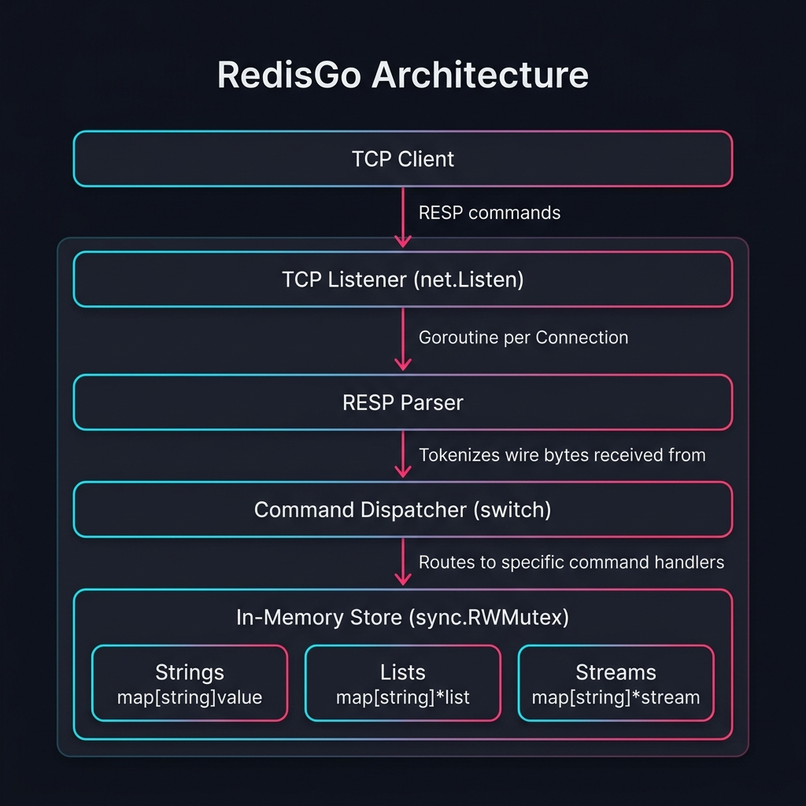
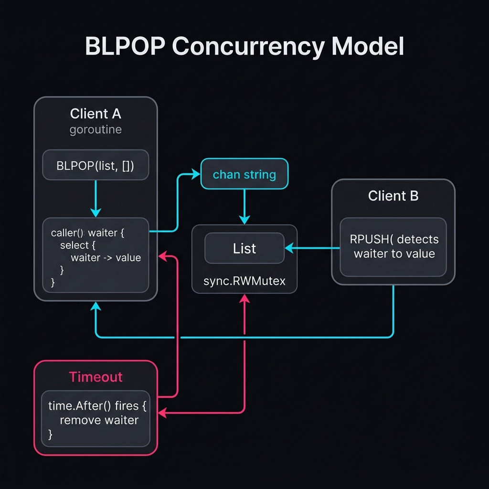
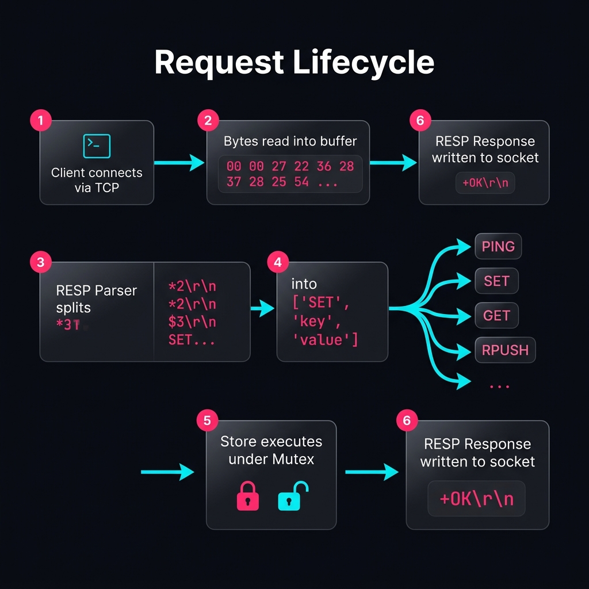
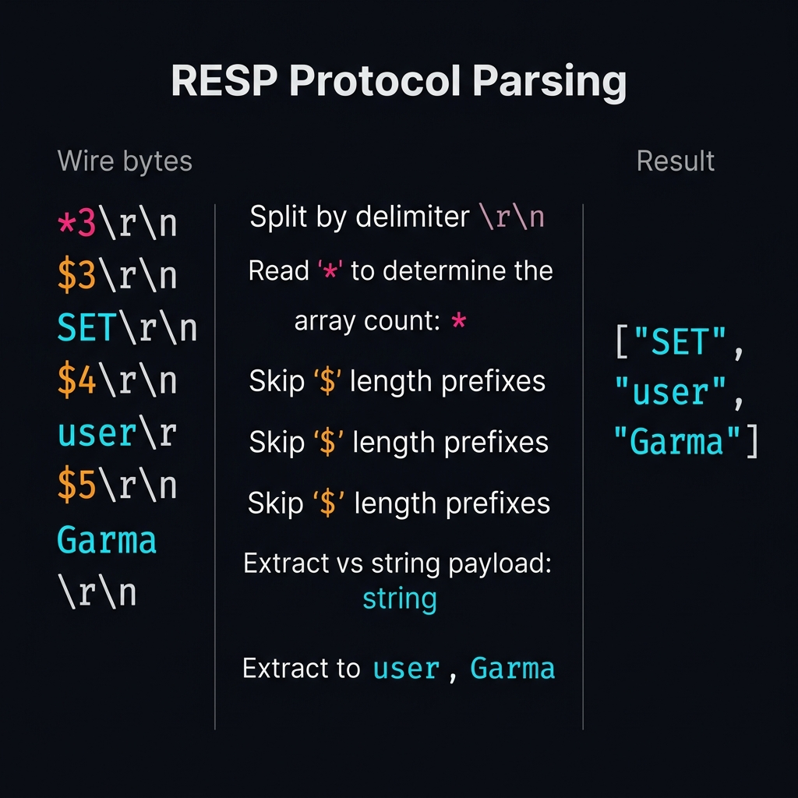

# RedisGo

RedisGo is a lightweight, efficient, and robust implementation of the Redis server in Go. Built as part of the CodeCrafters Redis challenge, this project aims to provide a functional and fast in-memory data structure store, supporting various Redis commands, transactions, and the RESP protocol.

## Features Supported
- **String Operations**: `SET`, `GET`, `INCR`, `TYPE`, with TTL expiration.
- **List Operations**: `LPUSH`, `RPUSH`, `LPOP`, `LLEN`, `LRANGE`, and the blocking `BLPOP`.
- **Stream Operations**: `XADD`, `XRANGE` with complex ID validation and resolution.
- **Transactions**: `MULTI`, `EXEC`, `DISCARD` for atomic execution.
- **Utility Commands**: `PING`, `ECHO`, `INFO`.
- **Replication**: Partial support for `REPLCONF` and `PSYNC` for master-slave replication handshake.

## Demos

### Strings

### Lists

### Streams

## Architecture & System Design

### High-Level Architecture

The server operates on a simple multi-threaded architecture where each incoming client connection is handled by a dedicated Goroutine. A central Thread-Safe Database acts as the primary data store, using `sync.RWMutex` to prevent race conditions across parallel queries.

### Concurrency Model

Concurrency is achieved by spawning a separate Goroutine for each TCP connection. Access to different data types (strings, lists, streams) is protected by lock mechanisms allowing concurrent reads (`RLock`) and exclusive writes (`Lock`). Blocking operations like `BLPOP` use Go channels (`waiters`) to suspend the Goroutine efficiently until data arrives, without polling or burning CPU cycles.

### Data Flow

1. The client sends a command over TCP.
2. The server reads the byte stream and passes it to the `resp` parser.
3. The parsed commands are evaluated in `server/handler.go`.
4. If in a `MULTI` block, commands are queued.
5. `executeCommand` interacts directly with `store.DB`, returning formatted RESP responses.

### RESP Protocol Parsing

The custom parser implements the RESP (Redis Serialization Protocol), primarily decoding Arrays and Bulk Strings sent by the Redis client. It extracts the command and arguments iteratively, ensuring robust validation against malformed packets.

## Architecture Decision Record (ADR)

### ADR 1: Implementation Language (Go)
**Context:** Need a language that handles network I/O and concurrency efficiently without excessive boilerplate.
**Decision:** We chose Go. Goroutines provide cheap, lightweight threads, and the `net` package offers highly performant socket programming out-of-the-box.
**Consequences:** Extremely straightforward concurrency handling.

### ADR 2: In-Memory Storage & Synchronization
**Context:** Redis is an in-memory data store. How should data be structured and protected from concurrent access?
**Decision:** We used standard Go primitives (maps, slices) guarded by a single `sync.RWMutex`.
**Consequences:** Simplifies implementation. Since most Redis commands are very fast, lock contention is minimal for this scale.

### ADR 3: Blocking Operations (BLPOP) Waiters
**Context:** `BLPOP` requires the server to wait if a list is empty, blocking the connection until another client pushes an element.
**Decision:** We implemented `waiters` as an array of Go `chan string` inside the `list` structure. A `BLPOP` will create a channel, append it to waiters, and block on a read. A push operation checks for waiters and sends the value directly down the channel if one exists.
**Consequences:** Immediate, event-driven resumption of blocked commands. Extremely efficient CPU usage compared to spin-locking.

### ADR 4: Transaction Queuing (MULTI/EXEC)
**Context:** Need to support atomic execution of multiple commands.
**Decision:** State is maintained per-connection (`inMulti`, `queuedCommands`). When `EXEC` is called, a local `bufferConn` mocks the `net.Conn` to capture all command outputs before aggregating them into a single RESP array response.
**Consequences:** Isolates transaction logic to the connection handler, preventing partially executed state from leaking to the client while still utilizing standard command handlers.

---
**Disclaimer**: This project is built for educational purposes and is a lightweight implementation of Redis Server functionalities.
